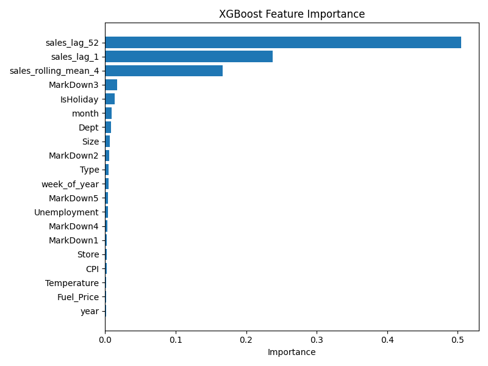
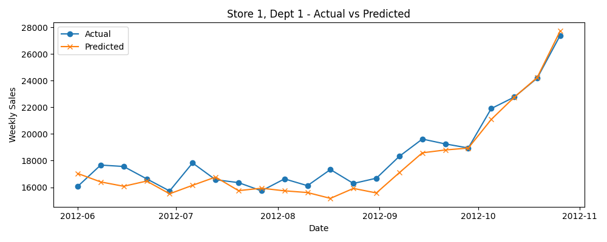
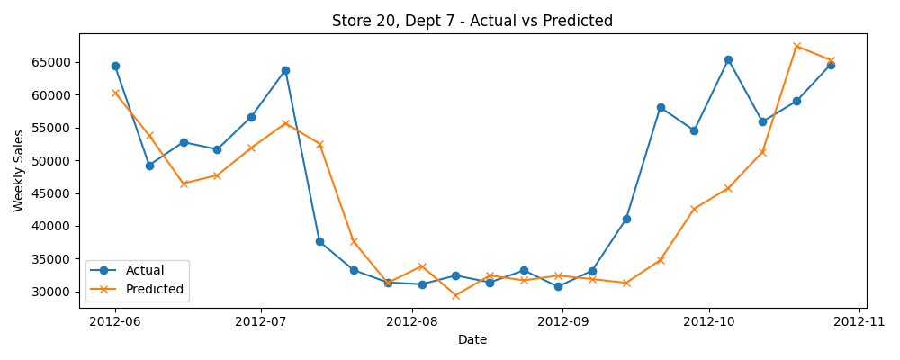

# Walmart Store Sales Forecasting
            

End-to-end demand forecasting pipeline built on the [Walmart Recruiting - Store Sales Forecasting](https://www.kaggle.com/competitions/walmart-recruiting-store-sales-forecasting) Kaggle dataset. Weekly sales are ingested and cleaned with pandas, feature-engineered, and forecast with XGBoost, benchmarked against a naive baseline using the competition's own weighted MAE metric.

Personal project, built to sharpen end-to-end forecasting skills spanning data cleaning, feature engineering, and model evaluation. Not affiliated with or endorsed by Walmart or Kaggle.

## Problem

Predict weekly department-wide sales for 45 Walmart stores, using historical sales, store metadata (type, size), and external features (temperature, fuel price, CPI, unemployment, promotional markdowns, holiday flags).

Evaluation uses **Weighted Mean Absolute Error (WMAE)**, the competition's own metric, which weights holiday weeks (Super Bowl, Labor Day, Thanksgiving, Christmas) 5x higher than regular weeks, since accuracy during these periods matters more for real-world inventory and staffing decisions.

## Architecture

```
Kaggle CSVs (stores, train, features)
        │
        ▼
  Load & join                (etl/load_data.py)
  - joined on Store/Date
  - MarkDown nulls handled explicitly (documented below)
        │
        ▼
  Feature engineering        (models/features.py)
  - lag sales (1wk, 1yr-ago same week)
  - rolling 4-week average
  - IsHoliday flag, store Type/Size, seasonality
        │
        ▼
  Model training              (models/train.py)
  - naive baseline (same week last year)
  - XGBoost regressor
  - time-based train/test split (no random split - avoids leakage)
        │
        ▼
  Evaluation                  (models/evaluate.py)
  - WMAE, feature importance, actual vs predicted plots
        │
        ▼
  API (stretch goal)          (api/main.py)
  - FastAPI endpoint returning a forecast for a given store/dept/date
```

## Dataset

Download from the [Kaggle competition page](https://www.kaggle.com/competitions/walmart-recruiting-store-sales-forecasting/data) (free account required, accept competition rules) and place the CSVs in `data/`:

- `stores.csv` - 45 stores, with Type (A/B/C) and Size
- `train.csv` - weekly sales by Store/Dept/Date, 2010-2012
- `features.csv` - Temperature, Fuel_Price, 5 MarkDown columns, CPI, Unemployment, IsHoliday
- `test.csv` - not used in this project (Kaggle leaderboard only)

Data files are gitignored; they are not included in this repo.

## Setup

```bash
git clone <repo-url>
cd walmart-demand-forecasting
python -m venv venv && source venv/bin/activate
pip install -r requirements.txt
python -m models.train
python -m models.evaluate
```

Run as modules (`python -m models.train`, not `python models/train.py`) so the project root resolves correctly on the import path.

To run the API locally:

```bash
uvicorn api.main:app --reload
```

Then open `http://127.0.0.1:8000/docs` for an interactive test UI.

## Results

| Model | WMAE |
|---|---|
| Naive baseline (same week last year) | 1,762.49 |
| XGBoost | 1,341.74 |

XGBoost improves on the naive baseline by **23.9%**. Feature importance confirms the model leans on the signals you'd expect for retail: same-week-last-year sales, last week's sales, and the trailing 4-week average dominate, with external factors (temperature, fuel price, CPI) contributing very little.



Actual-vs-predicted plots for individual store/department combinations show the model tracks the overall trend well, but lags on sharper week-to-week swings:




## Key decisions and honest limitations

- **MarkDown columns are mostly null before November 2011.** Treated as "no promotional markdown active" (filled as 0) rather than dropped, to avoid losing pre-Nov-2011 rows entirely. This is a judgement call, documented rather than silently applied.
- **Train/test split is time-based, not random**, since this is a forecasting problem and a random split would leak future information into training.
- **Single train/test split, not full walk-forward cross-validation.** With more time, walk-forward validation across multiple time windows would give a more robust estimate of real-world performance.
- **No per-department model specialization.** A single model is trained across all store/department combinations; separate models per department (or per store type) would likely improve accuracy but add significant complexity.
- **No hyperparameter tuning at scale** (e.g. no large grid/Bayesian search) given project scope; defaults and light manual tuning only.
- **Data storage stays in memory, no intermediate files.** `etl/load_data.py` loads and joins the raw CSVs on every run; for this dataset size that's fast enough that a saved staging file isn't needed.

## Tech stack

Python, pandas, XGBoost, scikit-learn, FastAPI (stretch goal), pytest, GitHub Actions.

## Tests and CI

`tests/test_features.py` covers the feature engineering logic (lag calculations, rolling averages, holiday flagging) with a small regression test suite. GitHub Actions runs these on every push (`.github/workflows/ci.yml`).
